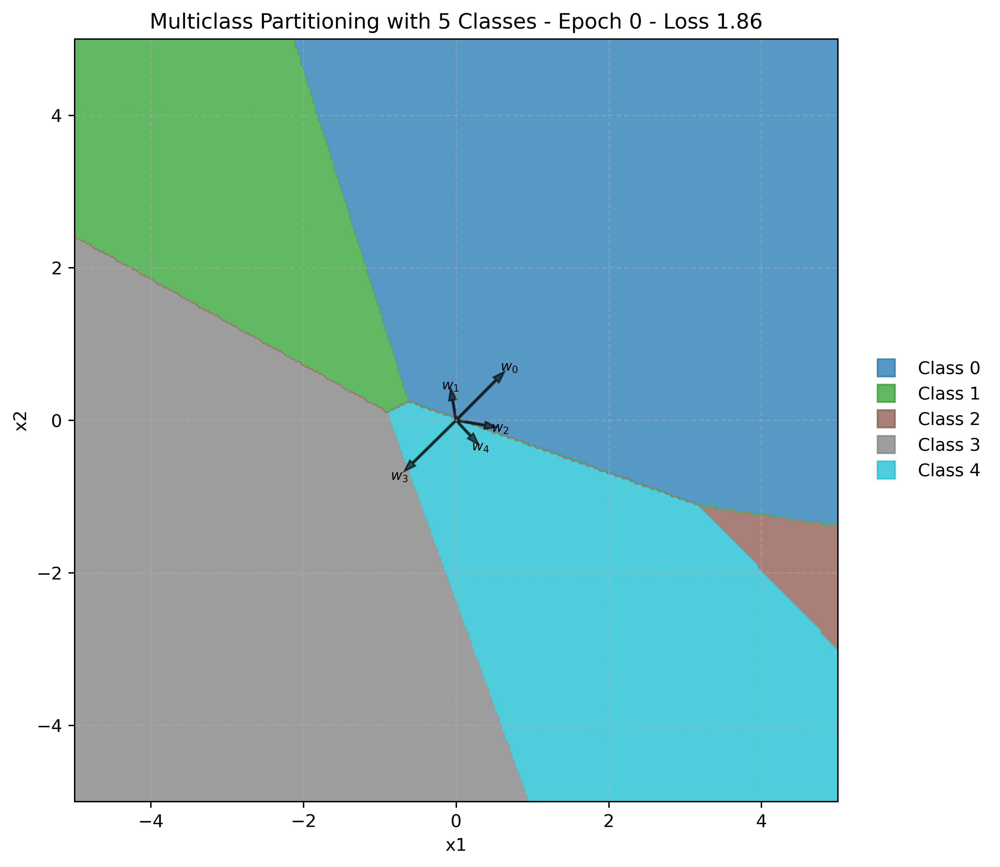

# Multiclass Voronoi Partition Visualization
This project explores and visualizes how the final linear layer of a simple neural network divides the input space in a multiclass classification setting. The network is trained on a toy dataset with up to 8 classes, using a straightforward memorization task chosen specifically to illustrate the partitioning process. By restricting the embedding space to two dimensions, the evolution of decision boundaries, weight vectors, and Voronoi regions can be easily visualized throughout training.  
The animation below shows how the weight vectors of the final layer and the corresponding Voronoi regions change during training (example shown for 5 classes):

  


## Mathematical Background

### Neural Network Structure

The network consists of:
- An embedding layer (for categorical input)
- A linear layer mapping to `n_classes` outputs
- A softmax activation for classification

Mathematically, the final layer computes for each class $k$:

$$s_k(\mathbf{x}) = \mathbf{w}_k^\top \mathbf{x} + b_k\$$

where:  
- $\mathbf{w}_k$ is the weight vector for class $k$ (k-th column of final weight matrix)  
- $b_k$ is the bias for class $k$  
- $\mathbf{x}$ is the input vector

The predicted class is:
$$\hat{y} = \arg\max_k s_k(\mathbf{x})$$

### The Role of the Weight Vectors $w_i$ 

The weight vectors $\mathbf{w}_k$ in the final layer play a crucial role in how the network partitions the input space. Each $\mathbf{w}_k$ can be interpreted as a prototype or "anchor" for class $k$ in the embedding space. The (biased) dot product between the input vector $\mathbf{x}$ and each $\mathbf{w}_k$ is calculated and the class yielding the highest score is selected as the prediction. Simplified speaking (e.g. if bias is zero) the weight vector most similar to the input yields the highest score.  
Geometrically, the arrangement and orientation of the weight vectors determine which input is assigned to which class. This also defines the decision boundaries and thus the shape and position of the Voronoi regions assigned to each class. As training progresses, the weight vectors adjust to best separate the classes according to the training data.

### Decision Boundaries

The decision boundary between class $i$ and class $j$ is defined by the set of points where their scores are equal:

$$
s_i(\mathbf{x}) = s_j(\mathbf{x}) \implies (\mathbf{w}_i - \mathbf{w}_j)^\top \mathbf{x} + (b_i - b_j) = 0
$$

This is a hyperplane (a line in 2D) separating the regions assigned to class $i$ and class $j$.

For an input $\mathbf{x}$, if $s_i(\mathbf{x}) > s_j(\mathbf{x})$, then the network assigns a higher score to class $i$ than to class $j$. Note that the final class assignment depends on the comparison across all classes, not just a single pair. However, if $s_i(\mathbf{x}) \gg s_j(\mathbf{x})$, it is very likely (but not guaranteed) that $\mathbf{x}$ will be assigned to class $i$, unless another class $k$ has an even higher score.


### Voronoi Partitioning

The input space is partitioned into regions (Voronoi cells), each corresponding to the set of points assigned to a particular class:
$$
\mathcal{R}_k = \left\{ \mathbf{x} \mid s_k(\mathbf{x}) > s_j(\mathbf{x}), \forall j \neq k \right\}
$$
The arrangement and orientation of the weight vectors $\mathbf{w}_k$ define these regions. As training progresses, the weight vectors move to best separate the classes, and the Voronoi regions adapt accordingly. In 2D, these regions can be visualized as polygons, and their evolution during training provides insight into how the network learns to classify the data.

Calculating the exact Voronoi partitions based on the analytical decision boundaries quickly becomes cumbersome, especially as the number of classes increases (see Figure below). Instead, the input space is densely sampled, and for each sample point, the predicted class is determined by the network. This approach allows for an efficient and visually intuitive approximation of the Voronoi regions, as each point is simply colored according to its predicted class.

The following figure illustrates why calculating the Voronoi partitions directly from the decision boundaries is cumbersome. Only certain segments of the decision boundaries actually contribute to the final Voronoi regions, and not all boundaries are relevant.

<p align = "center">

</p>


## Project Structure

- [`main.py`](main.py): Trains the neural network and generates partition visualizations.
- [`net.py`](net.py): Defines the neural network architecture.
- [`dataloader.py`](dataloader.py): Loads and prepares the dataset.
- [`utils.py`](utils.py): Contains plotting and utility functions for visualization.
- [`create_gif.py`](create_gif.py): Creates an animated GIF from the generated partition images.
- `figures/`: Stores generated images for each epoch.
- `gifs/`: Stores the animated GIF of the partition evolution.
- `test.ipynb`: Jupyter notebook for interactive experiments and visualizations.
- `data/semantic_word_dataset.txt`: Example dataset.

## Usage

1. **Install dependencies** (Python 3.8+, PyTorch, matplotlib, numpy, imageio):

   ```sh
   pip install torch matplotlib numpy imageio
   ```

2. **Train and visualizeInstall dependencies** 
   ```sh
   python main.py
   ```

3. **Create GIF animation**
    ```sh
    python create_gif.py
    ```

